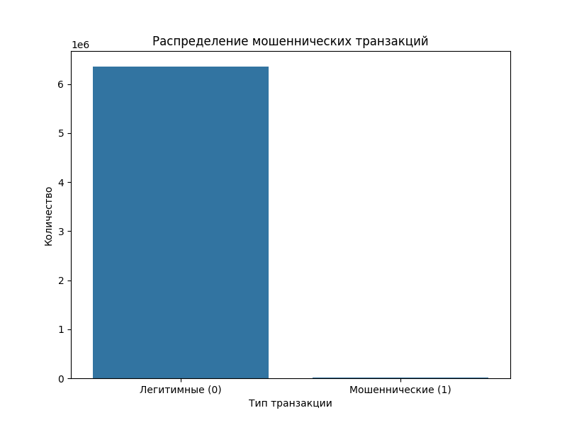
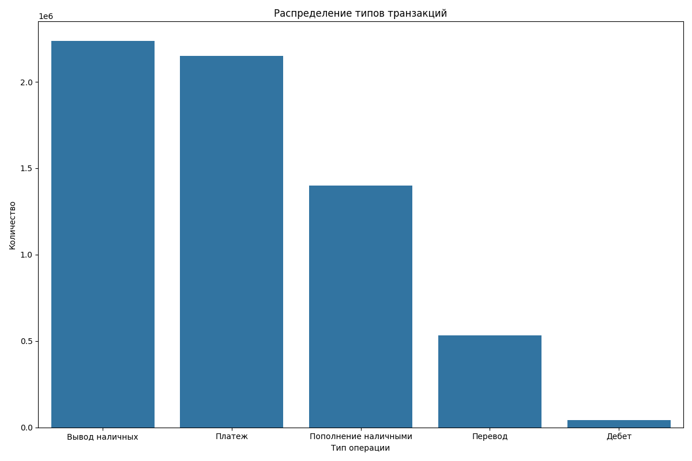
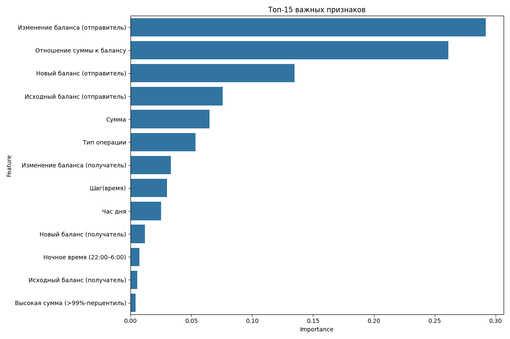

# Fraud Detection System  
**Нейросетевая система обнаружения мошеннических транзакций**  
ROC-AUC **0.9989** · Keras/TensorFlow · 6.36 млн транзакций · PaySim Dataset

---

### О проекте
Система в реальном времени определяет вероятность мошенничества в мобильных платежах.  
Используется полносвязная нейронная сеть (Keras), обученная с учётом всех ограничений датасета PaySim:  
**Избегнута утечка данных через `newbalanceOrig` / `newbalanceDest`** — вместо них созданы легитимные признаки (`balance_change_*`, `amount_to_balance_ratio` и др.).

---

### Ключевые результаты

| Метрика                        | Значение     |
|-------------------------------|--------------|
| **ROC-AUC**                   | **0.9989**   |
| Accuracy                      | 0.9834       |
| Precision (класс "мошенничество") | 0.9855    |
| Recall (класс "мошенничество")    | 0.9643    |
| F1-score                      | 0.9748       |
| Тестовых примеров             | 7 392        |
| Мошеннических в тесте         | 2 464 (33.3%)|                      |

> Модель уверенно отличает легитимные транзакции от подозрительных даже при сильном дисбалансе классов.

### Примеры предсказаний

1. Обычная дневная транзакция (маленький платёж):
Вероятность мошенничества: 0.3345%
Уровень риска: НИЗКИЙ

2. Подозрительный перевод ночью всей суммы на счёте:
Вероятность мошенничества: 94.2945%
Уровень риска: ВЫСОКИЙ
 
3. Обычное пополнение днём (CASH_IN):
Вероятность мошенничества: 0.0060%
Уровень риска: НИЗКИЙ

4. Очень большая сумма ночью + обнуление счёта (классическое мошенничество):
Вероятность мошенничества: 88.5974%
Уровень риска: ВЫСОКИЙ

5. Мелкий вывод наличных днём — норма:
Вероятность мошенничества: 3.9449%
INFO - Уровень риска: НИЗКИЙ


---

### Визуализация данных




---

### Структура проекта

FraudDetection/
├── data/                                       # датасет 
├── models/                                     # обученная модель model.joblib
├── visualizations/                             # графики
├── config.py                                   # все настройки и константы
├── functions.py                                # основной класс, функции
├── main.py                                     # точка входа в программу
├── fraud_detection.log                         # логи
└── README.md         

---

### Как запустить
При первом запуске модель обучается и сохраняется. При последующих - загружается.
```bash
git clone https://github.com/твой-username/FraudDetection.git
cd FraudDetection

python -m venv .venv
source .venv/bin/activate        # Windows: .venv\Scripts\activate

pip install pandas tensorflow scikit-learn imbalanced-learn matplotlib seaborn joblib

python main.py

```

### Технологии

1. Python 3.11+
2. TensorFlow / Keras
3. Pandas, Scikit-learn
4. Imbalanced-learn
5. Matplotlib / Seaborn

**Автор**: Бондарь Татьяна
**Github**: @tvbondar